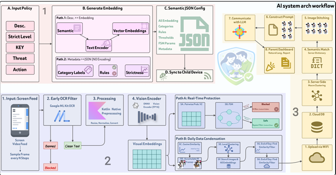

# ANIS — On-Device AI Pipeline

> A research-driven machine learning pipeline for real-time, privacy-first child safety moderation. Combines Multi-Label Sigmoid classification, LoRA fine-tuning, Large Vision-Language Model dataset harmonization, and edge-optimized ONNX inference — all designed to run the heavy lifting on-device.


---

## System Overview

The AI layer in ANIS solves a specific resource conflict: smartphones impose strict battery and memory constraints, yet meaningful content analysis requires significant computing power. The solution distributes the workload across **three stages** — offline policy engineering, real-time edge processing on the child device, and periodic cloud-side analysis — so that no single component is overloaded.



*Figure 4.2 — Three-stage AI system architecture of ANIS: policy engineering (top), child edge device pipeline (bottom-left), and cloud analysis node (bottom-right).*

---

## Repository Structure

```
ANIS-AI-onDevice/
│
├── model_training/                         # LoRA fine-tuning, ONNX export, FP16 quantization
│   └── README.md                           ← detailed pipeline docs
│
├── evaluation/                             # Academic benchmarking suite
│   └── README.md                           ← metrics, video FSM eval, quantization audit
│
├── research_and_experiments/               # Iterative research archive
│   └── README.md                           ← dataset structuring, distillation, LVLM harmonization
│
├── _asset/                                 # Diagrams and visual assets
├── .gitignore
├── LICENSE
└── README.md                               ← you are here
```

---

## Tech Stack


---

## Stage 1 — Policy Engineering (Offline / Server)

Converts a parent's content policy into a compact JSON configuration the child device can use locally — no further network requests required during monitoring.

A parent selects a strictness preset (Strict / Moderate / Balanced / Relaxed) or builds a custom policy. The server processes it through a **two-pipe configuration strategy**:

| Pipe | Input | Process | Output |
|---|---|---|---|
| **Pipe 1 — Semantic** | Plain-text category descriptions | Frozen CLIP Text Encoder | Feature vectors (semantic reference) |
| **Pipe 2 — Metadata** | Category labels, rule tags, thresholds | Pass-through (no encoding) | Structured plain text |

The two pipes merge into a single **Semantic JSON Config** file — distributed to the child device and stored locally as the device's rulebook for all real-time inference. The AI model is never asked to interpret rule names or threshold numbers as natural language.

→ See **[ANIS-Solutions/AI-hosted](https://github.com/ANIS-Solutions/AI-hosted)** for the policy server, embedding generation endpoint, and config distribution logic.

---

## Stage 2 — Edge Processing on the Child Device

Real-time content moderation running entirely on-device. Raw video never leaves the phone.

The child device captures screen frames at a fixed interval via the MediaProjection API. Each frame passes through an **OCR Early-Exit Filter** (Google ML Kit) — if a banned keyword is matched, the frame is blocked immediately without calling the vision model. Clean frames proceed to Kotlin Native preprocessing, then to the **FP16 ONNX Vision Encoder**, which produces a 512D visual embedding routed to two concurrent paths:

**Path A — Real-Time Protection:** Pairwise cosine similarity against policy reference vectors feeds a four-state **Temporal Finite State Machine (FSM)** that controls a blur overlay. The FSM requires N consecutive unsafe frames before blurring and M consecutive safe frames before clearing — preventing flicker on ambiguous or transitional content.

**Path B — Daily Data Condensation:** A background process deduplicates consecutive frames (cosine similarity >95%), applies local clustering to select representative keyframes, and produces a compact payload for end-of-day WiFi upload.

→ See **[ANIS-Solutions/Child-app](https://github.com/ANIS-Solutions/Child-app)** for the Android inference client, ONNX Runtime integration, FSM implementation, and the MediaProjection screen capture pipeline.

---

## Stage 3 — Cloud Analysis & Report Generation (Weekly / Backend)

Identifies behavioral patterns across a weekly window and generates a natural-language report for the parent dashboard.

1. **Macro-clustering** — server clusters all weekly vectors to identify dominant activity patterns
2. **Semantic matching** — clustered vectors matched against server-side semantic dictionary → human-readable category labels
3. **Image stitching** — representative keyframes stitched into one grid image (one LLM token budget for the whole week)
4. **LLM report generation** — structured prompt (labels + grid image) → natural-language behavioral report → parent dashboard

→ See **[ANIS-Solutions/AI-hosted](https://github.com/ANIS-Solutions/AI-hosted)** for the macro-clustering pipeline, semantic dictionary, image stitching, and the asynchronous Gemini webhook integration.

---

## Folder Guides

Each sub-directory has its own README with full technical detail:

| Folder | What it covers |
|---|---|
| [`model_training/`](./model_training/README.md) | LoRA fine-tuning pipeline, BCEWithLogitsLoss, asymmetric ONNX export, FP16 quantization, reproduction steps |
| [`evaluation/`](./evaluation/README.md) | Static image benchmarking, confusion matrices, real-time FSM video eval, FP32 vs FP16 quantization drift audit |
| [`research_and_experiments/`](./research_and_experiments/README.md) | Dataset taxonomy, knowledge distillation experiment (and why it was dropped), Qwen2-VL LVLM data harmonization |

---

## Key Design Decisions

| Decision | Rationale |
|---|---|
| CLIP LoRA over full fine-tuning | 4.2% trainable params; frozen base preserves zero-shot generalization |
| BCEWithLogitsLoss over CrossEntropy | Independent sigmoid per class; multiple threat categories can activate simultaneously |
| Pairwise probability scaling | Compares threat vs. safe logit directly; numerically stable and interpretable |
| Temporal FSM blur overlay | Prevents flicker on ambiguous frames; configurable trigger/release delays per policy |
| Asymmetric deployment split | Vision on-device (privacy); text on cloud (dynamic policy updates without redeployment) |
| LVLM data harmonization | Qwen2-VL as automated auditor resolves multi-source label noise before fine-tuning |
| Knowledge distillation (not adopted) | Binary MobileNet head lost multi-label nuance; CLIP LoRA retained |
| FP16 quantization + drift audit | 50% memory reduction; `flipped_decisions_test.py` verifies zero safety-critical flips |

---

## Related Repositories

| Repository | Role |
|---|---|
| [ANIS-Solutions/Child-app](https://github.com/ANIS-Solutions/Child-app) | Android client — ONNX inference, FSM, MediaProjection, data condensation |
| [ANIS-Solutions/AI-hosted](https://github.com/ANIS-Solutions/AI-hosted) | Cloud server — policy generation, macro-clustering, Gemini report pipeline |

---

Found a bug? [Open an issue](https://github.com/ANIS-Solutions/AI-onDevice/issues) with steps to reproduce.
