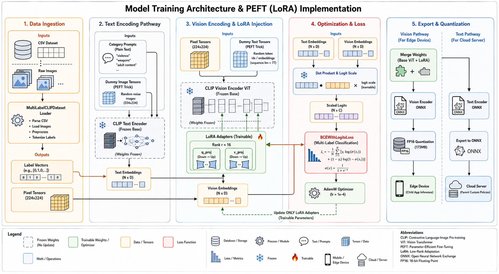

# model_training/

> Hybrid Multi-Task CLIP training pipeline using LoRA Co-Tuning on both encoders. Combines InfoNCE contrastive loss (learning deep semantic nuances from rich descriptions) with BCEWithLogitsLoss (enforcing hard policy boundaries from static category labels) — then exports an asymmetric, quantized inference graph for edge and cloud deployment.

← [Back to root](../README.md)

---

## Architecture Overview



*Hybrid Multi-Task CLIP Training & LoRA Co-Tuning Architecture — four-stage pipeline: data ingestion with dual text inputs, dual encoder co-tuning via LoRA, hybrid loss optimization (InfoNCE + BCE), and asymmetric ONNX export.*

---

## What Changed from v1

The original `train_lora.py` fine-tuned only the **vision encoder** using BCEWithLogitsLoss against static category prompts. This version introduces three fundamental upgrades:

| | v1 — `train_lora.py` | v2 — `train_hybrid_lora.py` |
|---|---|---|
| **Encoders tuned** | Vision only | Both vision + text (co-tuning) |
| **Text input** | Static category prompts only | Rich `clip_description` + static prompts |
| **Loss function** | BCEWithLogitsLoss only | InfoNCE + BCEWithLogitsLoss (hybrid) |
| **What it learns** | Hard policy boundaries | Deep nuances AND hard policy boundaries |
| **ONNX opset** | 14 | 18 |
| **Export cleanup** | Manual | Automated — temp files removed, merged dir deleted |

---

## Directory Structure

```
model_training/
├── train_hybrid_lora.py    # Dual co-tuning: InfoNCE + BCE hybrid loss
├── quantize_onnx.py        # Merge LoRA → split encoders → ONNX export → FP16 quantization
└── requirements.txt        # Pinned dependencies
```

---

## Stage 1 · Data Ingestion — `HybridCLIPDataset`

The dataset now carries **two text signals per image**, not one:

| Field | Type | Purpose |
|---|---|---|
| `filename` | string | Path to raw image |
| `clip_description` | rich text | Dynamic natural-language description of the image (from LVLM harmonization in `research_and_experiments/`) |
| `final_label` | category string | Static policy category — maps to multi-hot label vector |

```
CSV row:
  img_0001.jpg | "A golden retriever playing in the park" | Safe_General
  img_0002.jpg | "A man fighting in a dark alley"         | Unsafe_Violence
  img_0003.jpg | "A woman in a swimsuit"                  | Unsafe_Sexual
```

**Per-item output tensors:**

| Tensor | Shape | Used for |
|---|---|---|
| `pixel_values` | `(3, 224, 224)` | Vision encoder input |
| `rich_input_ids` | `(77,)` | Text encoder — contrastive task |
| `rich_attention_mask` | `(77,)` | Text encoder — contrastive task |
| `label_vector` | `(5,)` | BCE classification task |

**Label mapping:**

| `final_label` value | Index | Class |
|---|---|---|
| `Safe_General`, `Safe_Contextual_Body` | 0 | Safe Content |
| *(anything else)* | 1 | Neutral Objects |
| `Unsafe_Violence` | 2 | Violence |
| `Unsafe_Text` | 3 | Inappropriate Text |
| `Unsafe_Sexual` | 4 | Adult Content |

---

## Stage 2 · Dual Co-Tuning Encoders

Both the **CLIP Vision Encoder** and **CLIP Text Encoder** have LoRA adapters injected into their `q_proj` and `v_proj` attention projections. Both frozen base weights remain fixed; both sets of adapters receive gradients.

```python
lora_config = LoraConfig(
    r=16,
    lora_alpha=32,
    target_modules=["q_proj", "v_proj"],   # injected in BOTH encoders
    lora_dropout=0.05,
    bias="none"
)
```

**Modified forward pass per injection:**
```
h = W₀x + BAx     where B ∈ ℝ^(d×r), A ∈ ℝ^(r×k), r = 16
```

B is zero-initialized, A is Gaussian-initialized — the model begins training from exact pre-trained weights, adapters gradually learn task-specific adjustments.

**Three forward passes per training step:**

```python
# 1. Vision features (from image)
vision_outputs  = model.vision_model(pixel_values)
img_features    = project + L2-normalize

# 2. Rich text features (from clip_description — dynamic per image)
rich_outputs    = model.text_model(rich_input_ids, rich_attention_mask)
rich_features   = project + L2-normalize

# 3. Static policy features (from 5 category prompts — fixed per epoch)
static_outputs  = model.text_model(static_input_ids, static_attention_mask)
static_features = project + L2-normalize
```

The static prompts are pre-tokenized once before the loop. Their **embeddings** are re-computed each step (since the text encoder's LoRA adapters are still training), but the tokenization overhead is eliminated.

---

## Stage 3 · Optimization & Loss — Hybrid Objective

### Task 1 — Contrastive Loss (InfoNCE): *Learning Deep Nuances*

Pairs each image with its unique `clip_description`. The contrastive objective pulls matching image-text pairs together and pushes non-matching pairs apart in the embedding space:

```
L_contrastive = -log( e^(s_ii/τ) / Σⱼ e^(s_ij/τ) )
```

Computed symmetrically (image→text and text→image), averaged:

```python
ground_truth = torch.arange(batch_size)   # diagonal = correct pairs
loss_img = CrossEntropy(logits_per_image, ground_truth)
loss_txt = CrossEntropy(logits_per_text,  ground_truth)
contrastive_loss = (loss_img + loss_txt) / 2
```

This task teaches the model **nuanced visual semantics** — the difference between "a person in athletic clothing mid-sport" and "a person in revealing lingerie" — which the static category labels alone cannot encode.

### Task 2 — Classification Loss (BCE): *Setting Hard Policy Boundaries*

Uses static category prompts and the multi-hot `label_vector` to enforce hard policy boundaries:

```
L_BCE = -(1/NC) Σᵢ Σₖ [ yᵢₖ log σ(ŷᵢₖ) + (1 - yᵢₖ) log(1 - σ(ŷᵢₖ)) ]
```

Per-class sigmoid instead of softmax — multiple threat categories can be simultaneously active. This task teaches the model to respect the **explicit safety category taxonomy** defined by the parent's policy.

### Total Hybrid Objective

```
L_total = 0.5 · L_contrastive + 0.5 · L_BCE
```

The equal weighting (α = 0.5) is deliberate: neither task dominates. The contrastive signal prevents the model from collapsing to rigid decision boundaries that miss contextual edge cases. The BCE signal prevents the contrastive signal from drifting the embeddings away from the policy's semantic anchors.

**Training hyperparameters:**

| Parameter | Value |
|---|---|
| Base model | `openai/clip-vit-base-patch32` |
| LoRA rank (r) | 16 |
| LoRA alpha | 32 |
| LoRA dropout | 0.05 |
| Target modules | `q_proj`, `v_proj` (both encoders) |
| Optimizer | AdamW |
| Learning rate | `1e-4` |
| Batch size | 32 |
| Epochs | 10 |
| Loss weights | `W_contrastive = 0.5`, `W_BCE = 0.5` |
| Input resolution | `224 × 224` |
| Embedding dimension (D) | 512 |
| Number of classes (C) | 5 |
| Train/val split | 90 / 10 |

---

## Stage 4 · Export & Quantization — `quantize_onnx.py`

A single script handles the entire post-training pipeline: merge → split → export → quantize → clean up.

### Step 1 — Merge LoRA Weights

```python
peft_model = PeftModel.from_pretrained(base_model, LORA_DIR)   # load clip_hybrid_best/
merged_model = peft_model.merge_and_unload()                    # W_final = W₀ + BA
merged_model.save_pretrained(MERGED_DIR)                        # → merged_clip_model/
```

Both encoder sets of LoRA adapters are merged into their respective base weight matrices. After merging, the adapter matrices A and B are discarded — the model is a standard CLIP ViT with modified weights, requiring no adapter-specific code paths at inference.

### Step 2 — Split & Export to ONNX (opset 18)

Both encoder wrappers strip Hugging Face dictionary outputs for clean tracing:

```python
# Vision — pixel_values → image_embeds
class VisionEncoderWrapper(nn.Module):
    def forward(self, pixel_values):
        return self.model(pixel_values=pixel_values, return_dict=False)[0]

# Text — input_ids + attention_mask → text_embeds
class TextEncoderWrapper(nn.Module):
    def forward(self, input_ids, attention_mask):
        return self.model(input_ids=input_ids, attention_mask=attention_mask, return_dict=False)[0]
```

Exported at **opset 18** (up from 14 in v1) with `do_constant_folding=True`.

### Step 3 — Asymmetric Quantization & Packing

The pipeline bifurcates into two deployment-specific outputs:

**Vision Pathway → Edge Device · [Child App](https://github.com/ANIS-Solutions/Child-app)**

```python
vision_fp16 = float16.convert_float_to_float16(onnx.load("vision_model_fp32.onnx"))
onnx.save(vision_fp16, "vision_model_fp16.onnx")
```

FP16 post-training quantization halves the memory footprint from ~346 MB to **~173 MB** with zero quantization drift on safety decisions (verified by `evaluation/flipped_decisions_test.py`). Deployed to the Android child application's `assets/` folder for real-time on-device inference.

**Text Pathway → Cloud Server · [AI-Hosted](https://github.com/ANIS-Solutions/AI-hosted)**

```python
text_packed = onnx.load("text_model_fp32.onnx", load_external_data=True)
onnx.save(text_packed, "text_model_single.onnx")   # all weights in one file
```

The text encoder is packed into a single self-contained ONNX file (external data inlined) for reliable server deployment. No quantization — the cloud server has no memory constraints, and FP32 precision is retained for maximum semantic fidelity when generating zero-shot policy embeddings.

### Step 4 — Automatic Cleanup

The script automatically removes all intermediate files after a successful run:

```
vision_model_fp32.onnx        → deleted
vision_model_fp32.onnx.data   → deleted
text_model_fp32.onnx          → deleted
text_model_fp32.onnx.data     → deleted
merged_clip_model/            → deleted
```

Only the two final production models remain.

### Final Outputs

| File | Size | Destination | Repository |
|---|---|---|---|
| `vision_model_fp16.onnx` | ~173 MB | Android `assets/` — on-device inference | [Child-app](https://github.com/ANIS-Solutions/Child-app) |
| `text_model_single.onnx` | ~249 MB | Cloud server — policy embedding generation | [AI-hosted](https://github.com/ANIS-Solutions/AI-hosted) |

---

## Reproduce — Full Pipeline

### Prerequisites

- Python 3.9+
- CUDA-enabled GPU strongly recommended
- `final_dataset_v3_ready.csv` with `filename`, `clip_description`, and `final_label` columns (produced by `research_and_experiments/03_lvlm_data_harmonization.ipynb`)
- `train/` directory containing the raw image files

### 1. Install dependencies

```bash
pip install -r requirements.txt
```

### 2. Fine-tune — hybrid co-tuning

```bash
python model_training/train_hybrid_lora.py
```

Trains for 10 epochs. Progress bar shows total loss, contrastive loss, and BCE loss per batch. Saves PEFT adapter weights and processor after every epoch.

**Output:** `clip_hybrid_best/` — PEFT adapter weights + processor config

### 3. Export, quantize, and clean up

```bash
python model_training/quantize_onnx.py
```

Merges LoRA weights, exports both encoders to ONNX (opset 18), quantizes the vision model to FP16, packs the text model into a single file, and cleans up all intermediate files automatically.

**Output:** `vision_model_fp16.onnx` + `text_model_single.onnx`

---

## Notes & Known Limitations

- **No validation loop in `train_hybrid_lora.py`.** The checkpoint is saved every epoch regardless of performance. Adding a per-epoch eval pass (cosine similarity on a held-out set, or per-class BCE accuracy) is the highest-leverage improvement remaining.
- **Static prompt embeddings are re-computed every step.** Since the text encoder's LoRA adapters are training, this is technically necessary — the embeddings change each step. However, it means 3 forward passes per batch (vision + rich text + static text). An optimization would be to cache static embeddings for a few steps with a small staleness tolerance.
- **`logit_scale` is accessed via `model.base_model.model.logit_scale`** due to PEFT wrapping. This is a defensive path that should be verified against the specific PEFT version in `requirements.txt`.
- **opset 18** requires a recent version of `torch` and `onnx`. If Android NNAPI compatibility issues arise, downgrade to opset 14 in `quantize_onnx.py`.
- **`clip_description` field is required** in the CSV. Images without a valid description will tokenize an empty string — ensure the LVLM harmonization notebook has been run to completion before training.
